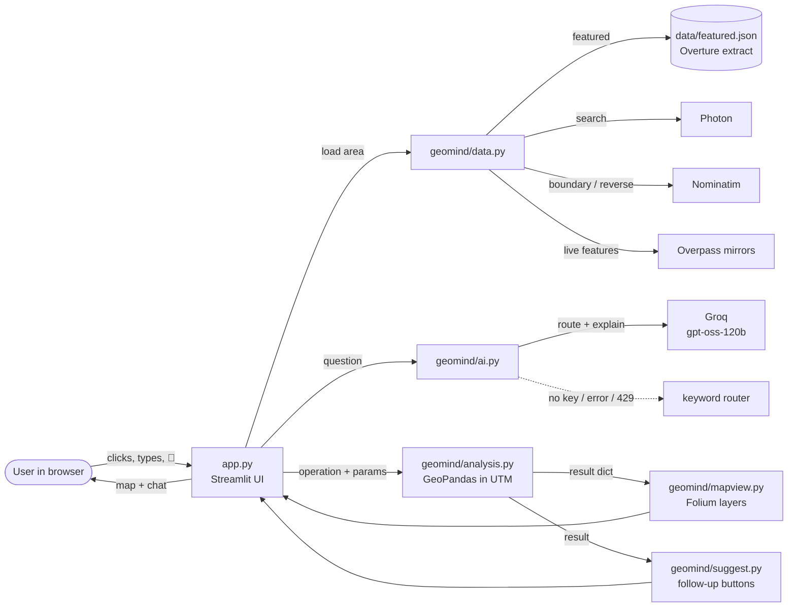
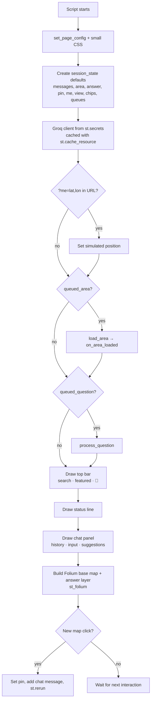
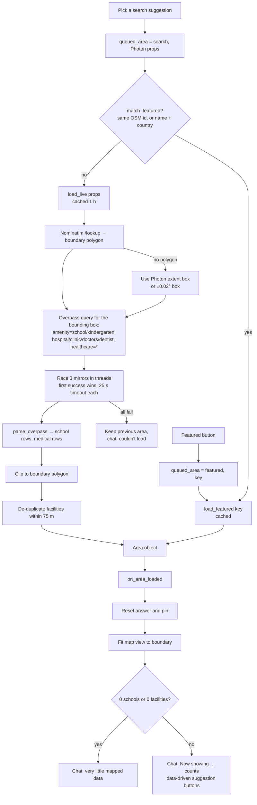
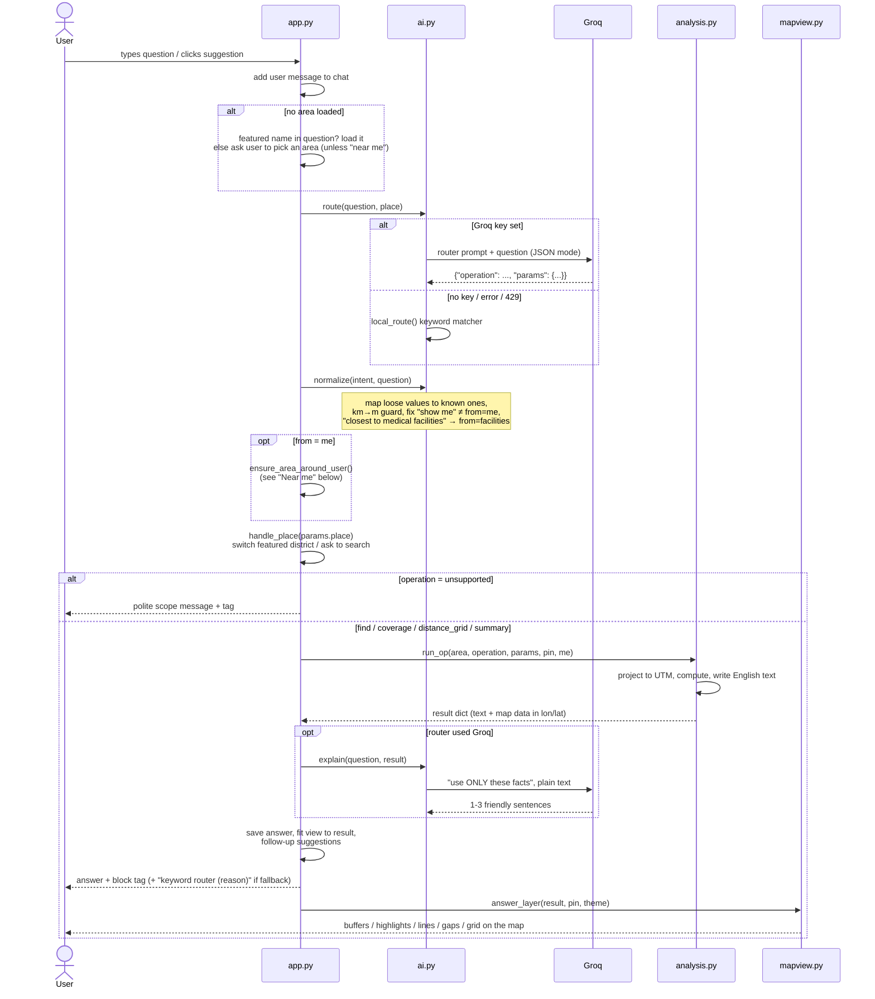
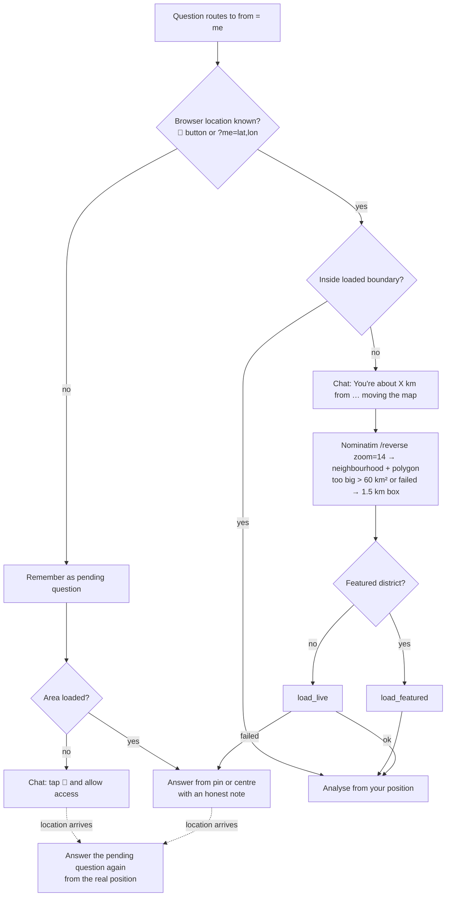

# 🗺️ GeoMind AI — Streamlit edition

Ask in plain English how close schools are to medical facilities, and get an answer
**computed from open map data** and drawn on a map.

This is the all-Python version of GeoMind AI, built so the team (who mostly read Python)
can compare it side by side with the original JavaScript app:

| | JavaScript app | This app |
|---|---|---|
| Where | Hugging Face Space `GeoMind-AI/geomind-ai` (static page) | Streamlit Community Cloud |
| Map | Leaflet + Turf.js | Folium (Leaflet) via `streamlit-folium` + GeoPandas/Shapely |
| AI calls | Browser → Cloudflare Worker → Groq | Python server → Groq (key in Streamlit Secrets) |
| URL | https://geomind-ai-geomind-ai.static.hf.space | https://geomind-ai.streamlit.app |
| First load | instant (static page) | ~20 s on a warm Streamlit server; longer after the app has been asleep |

## How it works (short version)

1. **Pick an area.** Tap a featured district (Ghirnatah, Gulberg, Clifton — prebuilt Overture Maps
   extracts in `data/featured.json`) or search any place (suggestions from Photon; schools and
   clinics downloaded live from OpenStreetMap via Overpass).
2. **Ask a question.** The AI (Groq, `openai/gpt-oss-120b`) only fills in **one of five analysis blocks**
   as JSON. It never computes a number.
3. **GeoPandas computes the answer** in the local UTM projection (metres), and the map shows it.
4. The AI re-phrases our computed facts in 1–3 sentences (it may not add facts). The **block tag**
   (e.g. `find(target=schools, relation=within, distance_m=250)`) is shown under every answer.

## Tech stack

### Languages, framework and hosting

| What | Used for |
|---|---|
| **Python 3.12** | the whole app — no JavaScript written by us |
| **Streamlit** | turns `app.py` into a web page: layout, buttons, chat, session state, caching, secrets |
| **Streamlit Community Cloud** | free hosting, deploys automatically from this GitHub repo; stores `GROQ_API_KEY` in Secrets |
| **GitHub** | source code; every push to `main` redeploys the app |

### Python libraries (`requirements.txt`)

Versions are the ones the app was built and tested with.

| Library | Version | Used in | What it does for us |
|---|---|---|---|
| `streamlit` | 1.63.0 | `app.py` | page layout (`st.columns`, `st.container`), chat (`st.chat_message`, `st.chat_input`), buttons, `st.session_state`, `st.cache_data` / `st.cache_resource`, `st.secrets`, `st.context.theme` |
| `streamlit-folium` | 0.27.4 | `app.py` | shows a Folium map inside Streamlit (`st_folium`) and returns map clicks; `feature_group_to_add` updates answer layers without rebuilding the map |
| `folium` | 0.20.0 | `mapview.py` | builds the Leaflet map from Python: tile layers, `GeoJson`, `CircleMarker`, `Circle`, `PolyLine`, `FeatureGroup` |
| `geopandas` | 1.1.4 | `data.py`, `analysis.py` | tables of map features (`GeoDataFrame`), CRS conversion (`to_crs`, `estimate_utm_crs`), buffers, point-in-polygon |
| `shapely` | 2.1.2 | `data.py`, `analysis.py` | geometry objects and operations: `Point`, `box`, `shape`, `unary_union`, `difference`, `contains`, `mapping` |
| `pyproj` | 3.8.0 | (via GeoPandas) | the actual coordinate transformations between longitude/latitude and UTM metres |
| `numpy` | 2.5.3 | `analysis.py` | fast nearest-neighbour distance matrices and quantiles |
| `requests` | 2.34.2 | `data.py` | HTTP calls to Photon, Nominatim and Overpass (with timeouts) |
| `groq` | 1.7.0 | `ai.py` | official Groq SDK: chat completions with JSON mode; raises `status_code=429` on rate limits |
| `streamlit-searchbox` | 0.1.24 | `app.py` | search box with live, as-you-type suggestions (`st_searchbox`) |
| `streamlit-geolocation` | 0.0.10 | `app.py` | the 📍 button that asks the browser for the user's GPS position |
| `pytest` | 9.1.1 | `tests/` | automated tests (not needed to run the app) |

Installed automatically as dependencies: `pandas` (tables under GeoPandas), `pyogrio` (file I/O for GeoPandas),
`branca` (HTML/colour helpers for Folium), `httpx`/`pydantic` (used inside the Groq SDK).

Standard library modules used: `concurrent.futures` (racing Overpass mirrors in threads), `dataclasses` (the `Area`
object), `json`, `re` (keyword router and guard rails), `math`, `pathlib`, `tomllib` (tools script).

### AI model

| | |
|---|---|
| Provider | **Groq** (fast inference, free tier) |
| Model | **`openai/gpt-oss-120b`** |
| Call 1 — route | `temperature=0`, `response_format={"type": "json_object"}` → one analysis block as JSON |
| Call 2 — explain | `temperature=0.3`, plain text, "use ONLY the facts given" |
| Fallback | `geomind/ai.py → local_route()` keyword matcher (no network), used on no key / any error / HTTP 429 |

### External data sources and web services (all free, no API key)

| Service | URL | Used for | Called from |
|---|---|---|---|
| **Overture Maps** | overturemaps.org | the prebuilt featured districts (`data/featured.json`, built offline by `tools/make_featured.py`) | offline only |
| **Photon** (Komoot) | photon.komoot.io | search-as-you-type place suggestions | `data.photon_search` |
| **Nominatim** (OpenStreetMap) | nominatim.openstreetmap.org | area boundary polygons (`/lookup`) and "which neighbourhood am I in?" (`/reverse`) | `data.nominatim_polygon`, `data.reverse_area` |
| **Overpass API** (3 public mirrors) | overpass-api.de, overpass.private.coffee, overpass.kumi.systems | live schools / hospitals / clinics / doctors / dentists from OpenStreetMap | `data.fetch_overpass` |
| **Esri Canvas basemaps** | server.arcgisonline.com | light and dark grey map tiles | `mapview.TILES` (loaded by the browser) |
| **Browser Geolocation API** | (in the user's browser) | the user's position for "near me" | `streamlit-geolocation` |

### Key GIS techniques

| Technique | Where | Why |
|---|---|---|
| **UTM projection** (`estimate_utm_crs`) | `analysis.Projected` | distances and areas in metres, correct for any city on Earth |
| **Nearest neighbour** (numpy distance matrix, chunked) | `analysis.nearest` | "distance from each school to its nearest facility", skipping a feature measuring to itself |
| **Buffer → union → difference** | `analysis.op_coverage` | exact coverage-gap polygons |
| **Square grid + centroid-in-polygon** | `analysis.make_cells` | the ~600-cell distance map |
| **Spatial clip** (`within`) | `data.load_live` | keep only live features inside the real boundary |
| **Proximity de-duplication (75 m)** | `data.dedupe` | the same clinic mapped as a point and as a building counts once |
| **Web Mercator zoom fitting** | `mapview.view_for_bounds` | zoom the map so an answer fits the screen |

## Detailed application flow

### 1. The big picture



The golden rule: **the AI chooses, Python computes.** Every number in an answer comes from `analysis.py`.

### 2. What happens on every click (the Streamlit rerun)

Streamlit runs `app.py` **from top to bottom on every interaction**. Anything that must survive between
runs lives in `st.session_state`. `app.py` is ordered so work is done *before* anything is drawn:



Buttons and the chat box don't do the work directly: their **callbacks** only put the request in a queue
(`queued_area` / `queued_question`). The next run processes the queue at step F/G, so the new messages and map
layers appear in that same run.

### 3. Loading an area



**`Area`** (in `data.py`) is the one object the rest of the app uses: `name`, `source`
(*Overture extract* or *Live OpenStreetMap*), `boundary` (Shapely polygon), `schools` and `facilities`
(GeoDataFrames of points with `name` and `category`), and `key` for featured districts.

**Suggestions are data-driven** (`suggest.build_suggestions`): the distance in "Which schools are more than *X* from
a medical facility?" is the area's median school-to-facility distance rounded up to a nice value, and the hospital
question only appears if hospitals are mapped there.

### 4. Answering a question



### 5. Inside the analysis blocks (`analysis.py`)

Every block starts by building `Projected(area)`: the boundary, schools and facilities re-projected to the
local **UTM** zone so all distances are in metres. Hospitals = facilities whose category contains "hospital".

| Block | Steps | Map layers drawn (`mapview.answer_layer`) |
|---|---|---|
| **find** | 1. `target` features (schools / facilities / hospitals; hospitals fall back to facilities if none).<br>2. `resolve_from`: a **set** (facilities / schools / hospitals) or a **point** (pin, me, centre) — with honest notes when falling back.<br>3. Distance for every target: to the point, or to the nearest feature of the set (never itself).<br>4. Filter `within` / `beyond` distance (default = area's median distance), sort nearest/farthest, limit ≤ 25.<br>5. Text: count, single best, or ranked list with nearest names. | reference point + dashed radius circle, or a buffer ring around each reference feature (≤150); highlighted hits (green within / amber beyond); dashed lines to the nearest feature |
| **coverage** | 1. Buffer every target facility by *d* m.<br>2. `unary_union` of all buffers = covered zone.<br>3. `boundary.difference(covered)` = **gap polygon**.<br>4. % of area = gap area ÷ boundary area; schools in gap = nearest facility > *d*. | shaded gap polygons, buffer rings, schools in gaps outlined |
| **distance_grid** | 1. Square cells ≈ area/600 (min 50 m), keep cells whose centre is inside the boundary.<br>2. Distance from each cell centre to the nearest target.<br>3. Breaks at the 20/40/60/80 % quantiles rounded to nice values → 5-colour green→red ramp. | coloured squares + legend |
| **summary** | area km², counts, schools per km², facilities per school, average school→facility distance, farthest school. | dashed line from the worst-served school to its nearest facility |
| **unsupported** | no computation; handled in `app.py`. | — |

### 6. The map (`mapview.py` + `streamlit-folium`)

- **Base map** (`base_map`): Esri light or dark tiles (from `st.context.theme`), boundary outline, a red dot per
  facility and blue dot per school. Rebuilt only when the area or theme changes.
- **Answer layer** (`answer_layer`): the current answer and the user's pin, passed as
  `feature_group_to_add`, so it updates **without** rebuilding the map — your zoom and position are kept.
- **View** (`view_for_area`, `view_for_result`): after loading an area or answering, the app computes a centre and
  Web-Mercator zoom that fits the boundary, or the answer's points (including line ends and the search radius).
- **Pin**: `st_folium(..., returned_objects=["last_clicked"])` returns the click; a new click sets `pin`, adds
  "Pin set…" to the chat and reruns. Marker clicks open popups without dropping a pin
  (`bubbling_mouse_events=False`).

### 7. "Near me"



### 8. Failures and fallbacks

| Situation | What the user sees |
|---|---|
| No `GROQ_API_KEY` | status line says *keyword router*; answers use computed text; tag ends with `keyword router (no Groq key)` |
| Groq rate limit (429) or any Groq error | same blocks via keyword router; tag ends with `keyword router (rate limited (429))` |
| Explain call fails | the computed text is shown instead |
| All Overpass mirrors fail | previous area stays; chat says it couldn't load |
| Very few features mapped | chat warning, no suggestions |
| No hospitals mapped | analysis uses all medical facilities and says so |
| "this location" but no pin | uses the centre of the area and says so |
| Place named that isn't loaded | chat asks the user to search for it |
| Analysis raises an error | "Something went wrong running that analysis" |

### The five blocks

| Block | What it does | Example question |
|---|---|---|
| `find` | list/count schools, facilities or hospitals, all / within / beyond a distance from facilities, schools, hospitals, your pin, your location or the centre | “Which schools are more than 3 km from a medical facility?” |
| `coverage` | exact gap polygons: buffer every facility → union → boundary minus union; % of area and schools in the gaps | “Which areas have poor access to healthcare?” |
| `distance_grid` | ~600 squares coloured by distance to the nearest school/facility | “How far is the nearest school from each neighbourhood?” |
| `summary` | size, counts, densities, average distance, farthest school | “Are there enough schools in this neighbourhood?” |
| `unsupported` | polite refusal for off-topic questions | “What's the weather today?” |

If the AI is unavailable (no key, error, or free-tier **rate limit 429**) a **keyword router**
picks the same blocks and the computed text is shown; the tag then says `keyword router (reason)`.

### Map features
- Click the map to drop a **pin** (“schools within 1 km of this location”).
- **Near me:** tap the 📍 button at the top right. If you are outside the loaded area, the app finds
  your neighbourhood (Nominatim reverse geocoding), loads it and answers from your position. Without
  a location it answers from your pin or the area centre and says so.
- Light/dark basemaps (Esri) follow the Streamlit theme (⋮ menu → Settings). Chat history is kept.
  Streamlit does not rerun the script on a theme change, so the basemap switches on your next click.

## Project layout

```
app.py                 the Streamlit UI (top bar, map on the left, chat on the right)
geomind/data.py        featured extracts, Photon search, Nominatim, live Overpass (raced mirrors)
geomind/analysis.py    find / coverage / distance_grid / summary with GeoPandas in UTM
geomind/ai.py          Groq client, router prompt, normalize() guard rails, keyword fallback, explain
geomind/suggest.py     data-driven suggestion buttons and follow-ups
geomind/mapview.py     Folium map: boundary, markers, answer layers, basemaps, view fitting
data/featured.json     prebuilt Overture extracts (see tools/make_featured.py)
tests/                 pytest checks (no internet or key needed) + router_raw.json
tools/make_featured.py rebuilds data/featured.json with the Overture Maps CLI
tools/check_groq_router.py  runs the tester questions against the real Groq model
.streamlit/config.toml server settings (theme left to the user's Light/Dark choice)
requirements.txt       Python dependencies installed by Streamlit Community Cloud
```

## Run locally

```bash
python -m venv .venv
.venv\Scripts\activate          # macOS/Linux: source .venv/bin/activate
pip install -r requirements.txt
streamlit run app.py
```

Optional AI key for local runs — create `.streamlit/secrets.toml` (it is git-ignored):

```toml
GROQ_API_KEY = "your-groq-key"
```

Without a key the app still works using the keyword router.

**Testing “near me” without moving:** open `http://localhost:8501/?me=31.5120,74.3430` (latitude,longitude).

### Tests

```bash
pip install pytest
pytest
```

Checks: Ghirnatah 8 schools / 16 facilities; Gulberg 79 / 59 with 43 schools within 250 m; Clifton 54 / 35;
Ghirnatah coverage at 500 m; `normalize()` guard rails; the 18 tester questions all route to a real block with
the keyword router; weather → `unsupported`; 429 fallback; Overpass parsing and 75 m de-duplication.

`tools/check_groq_router.py` runs the tester questions against the real model (paced for the free tier)
and compares the chosen blocks with `tests/router_raw.json`.

## Deploy on Streamlit Community Cloud

1. Go to https://share.streamlit.io and sign in with GitHub.
2. **Create app** → *Deploy a public app from GitHub* → repository `arahmanmdmajid/geomind-ai`,
   branch `main`, main file `app.py`. Under **Advanced settings** pick Python 3.12.
3. In the same Advanced settings (or later: app ⋮ → **Settings → Secrets**) paste:
   ```toml
   GROQ_API_KEY = "your-groq-key"
   ```
4. **Deploy**. The first build installs GeoPandas and takes a few minutes; later cold starts are faster.
5. Put the app URL in the table at the top of this README (done: https://geomind-ai.streamlit.app).

Free Community Cloud apps go to sleep after a period without visitors; the first visitor then
clicks "Yes, get this app back up" and waits for it to restart.

## Differences from the JavaScript app (deliberate)

- **Coverage uses exact polygons** (buffer → union → difference) instead of a grid of squares, so the
  % can differ by a few points in other areas (Ghirnatah at 500 m: both give 39%).
- **Live OSM features are clipped to the area boundary** (the JS app keeps everything in the bounding box).
- Streamlit cannot ask for the browser location from code, so “near me” uses a 📍 button; a question
  asked before sharing the location is answered again automatically once it arrives.

Data: Overture Maps Foundation, © OpenStreetMap contributors. Tiles © Esri.
